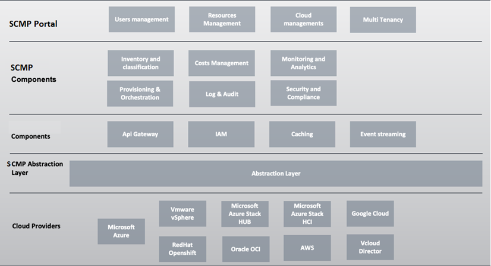

# Welcome to CMP Docs 1.0.0

SCMP è la piattaforma di cloud management di Leonardo S.p.a. che permette la governance, la gestione del ciclo di vita, il brokering e l’automazione delle risorse gestite in ambiente cloud.

## In breve

La soluzione di Secure Cloud Management Platform, in linea con la definizione di Gartner indicata nei Documenti di riferimento, è una piattaforma operativa che permette la governance, la gestione del ciclo di vita, il brokering e l’automazione delle risorse gestite in ambiente cloud e si divide nelle seguenti aree funzionali:
*	Inventory and classification
*	Monitoring and analytics
*	Cost management and workload optimization
*	Security & compliance
*	Orchestration and Provisioning

La piattaforma supporta gli ambienti su Google Cloud, Microsoft Azure, VMware, Azure Stack HUB & HCI, Red Hat Openshift, Amazon Web Servceis (AWS), Oracle OCI, data la loro ampia presenza nel settore Enterprise.

## Architettura

L’architettura di SCMP (vedi Figura 1) è un’architettura a moduli come descritto di seguito:

•	SCMP Portal: Una soluzione di front end web e mobile flessibile, consente di comporre la soluzione verso diverse esigenze del cliente. Permette la gestione degli utenti, delle risorse come virtual machines, storages, networks e consente di effettuare monitoring e provisioning di tutte le risorse di ogni cloud provider configurato. 
•	SCMP Components: In questo layer vengono inserite tutte le componenti della piattaforma sviluppate per poter erogare le funzionalità di gestione della piattaforma cloud management.
•	SCMP Abstraction Layer: L’Abstraction Layer consente di fornire un livello di astrazione delle risorse erogate dai cloud providers implementando direttamente i protocolli di comunicazione specifici e uniformando l’accesso a risorse della stessa tipologia.
•	SCMP Platform Components: In questo layer vengono inserite tutte le componenti della piattaforma gestite con soluzioni di terze parti. In questo layer sono presenti i sistemi di identificazione, la soluzione di Api gateway, il sistema di cache e la gestione dei topics.
•	Cloud providers: In questo layer vengono inseriti tutte le piattaforme cloud che la SCMP riesce a supportare, come Microsoft Azure, Vmware vSphere, Google Cloud Provider (GCP), Amazon Web Services (AWS), Red Hat Openshift, Microsft Azure Stack Hub and Microsoft Stack HCI, RedHat Openshift e Vcloud Director e Oracle.

#### sono una didascalia per l'immagine

##Informazioni utili

la pagina è disponibile all' [indirizzo]()

a
a
a
a
a
a
a
a
a

aa

a
a
a
aa

a
a
aa

a
aa
a
a
a
a
a
a
a
a
a
a
a
a
a
a
a
a
a
a
a
a
aa
a
a
a
a
a
a
a
a
a
a
a
a
a

[torna a immagine](index.md#sono una didascalia per l'immagine)